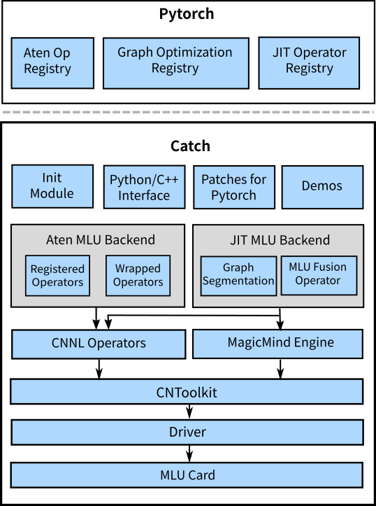

--------------------------------------------------------------------------------

CATCH is a PyTorch extension package that enables PyTorch to support the Machine Learning Unit(MLU) backend, 
in both high-performance training and inference.
Unlike PyTorch's integrated backends such as cuda, cudnn etc., CATCH is provided independently with patches to original 
PyTorch repository. Together with PyTorch, CATCH provides strong MLU acceleration for neural network computation:
- Inference layer-by-layer in eager mode or using TorchScript interface in fusion mode.
- Training with single or multiple card.

The overview of CATCH structure is demonstrated below:

Currently it supports several versions of Cambricon MLUs, which are listed as follows:
 - series of MLU370

## Installation

### From Source Code(for CATCH contributors)

CATCH depends on PyTorch and Cambricon Neuware Libs. The detailed setup steps can be referred to [CONTRIBUTING.md](CONTRIBUTING.md)

### Docker Image

#### Using pre-built images

Pre-built docker image is also published. It is referred to [using CATCH in Docker](docs/user_guide/source/pytorch_4_installation/Pytorch_installation.rst) for explaining how to use our dockers.

#### Building the image yourself

- make sure the neuware_home is in your current directory.
- bash docker/docker_build.sh -r docker -d open_pytorch_centos76 -t open_bata -f docker/open_dockerfile.base_centos7.6.framework .

## Getting Started

### Inference

Currently, the network can run in eager or fusion mode with the precision of float32 or float16. Each is accompanied with a completed example located in [examples/inference](examples/inference). Furthermore, another example with explanation can be found in [Quick Guide for Inference](docs/user_guide/source/pytorch_5_quickguide/Pytorch_quickguide.rst).

### Training

Training with single MLU card or multiple MLU cards using DDP interface is possible. The example scripts are demonstrated in [examples/training/single_card_demo.py](examples/training/single_card_demo.py) and [examples/training/multi_card_demo.py](examples/training/single_card_demo.py). Furthermore, another example with explanation can be found in [Quick Guide for Training](docs/user_guide/source/pytorch_5_quickguide/Pytorch_quickguide.rst).

## Documentation

For more information about CATCH, such as supported operators and their constraints, customized operation etc., please see [documentation](docs)

## License

CATCH has a BSD 2-Clause License, as found in the [LICENSE](LICENSE) file.
